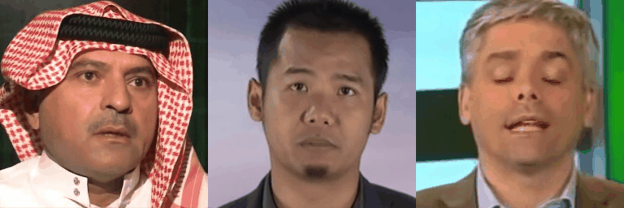
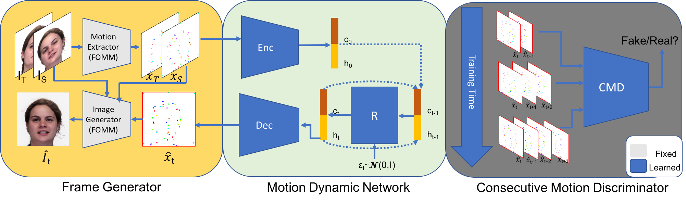

## Video Generation from FOMM based Model 


FOMM(First-Order Motion Model) is a critically claimed image translation model, a driven video is required FOMM to generate coherent videos, we explored 
the possibility to use FOMM as the image generation model 
for the task of video generation, we are interested in two 
types of video generation:

1. Video prediction from a single image(VP)


2. Frame interpolation from an image pair(VI)



Our model works in the following way:

In simple words, we generate videos by 
training a conditional motion generator in FOMM's motion representation space.

### Create environment
```console
$ conda create env --name fommvg python=3.7
$ conda activate fommvg
$ pip install -r requirements.txt
```

### Pre-trained models:
We use [TPSMM](https://github.com/yoyo-nb/Thin-Plate-Spline-Motion-Model) as our frame generator, please download ```vox.pth.tar```, and put it into ```pretrained_models```.

### Prepare datasets:
Our model can be trained on various talking 
head dataset(Vox, RAVDESS, Face Forensics .etc), however,
the dataset need to be aligned and structured the same as   [FOMM](!https://github.com/AliaksandrSiarohin/first-order-model)'s training data.

### Training:
Video prediction:
```console
$ python train_vp.py --dataset {dataset name} --kps_root {path to motion representations} --vid_root {path to video datasets} --max_seq_len 16 --weight_lm 0.5 --exp_name vp --log_dir logs/
```
Frame interpolation:
```console
$ python train_fi.py --dataset {dataset name} --kps_root {path to motion representations} --vid_root {path to video datasets}--max_seq_len 16 --batch_size 600 --weight_lm 10. ---epoch_size 600 --nepochs 1000  --log_dir logs/fi
```
### Checkpoint:

[Google Drive](https://drive.google.com/drive/folders/1ozSXgwMhCMAOWCmvobLmGmAh9OotfzlN?usp=share_link)

### Testing:
Testing for video prediction:
```console 
$ python test_vp.py --network_pkl {path to checkpoint} --image_path {path to input image} --nframes {number of frames to generate} --result_dir {path to save results}
```
Testing for frame interpolation:
```
$ python test_fi.py --src_path {path to the intial frame} --tgt_path {path to ending frame} --ckpt {path to checkpoint} --sav_path {path to save results}
```
